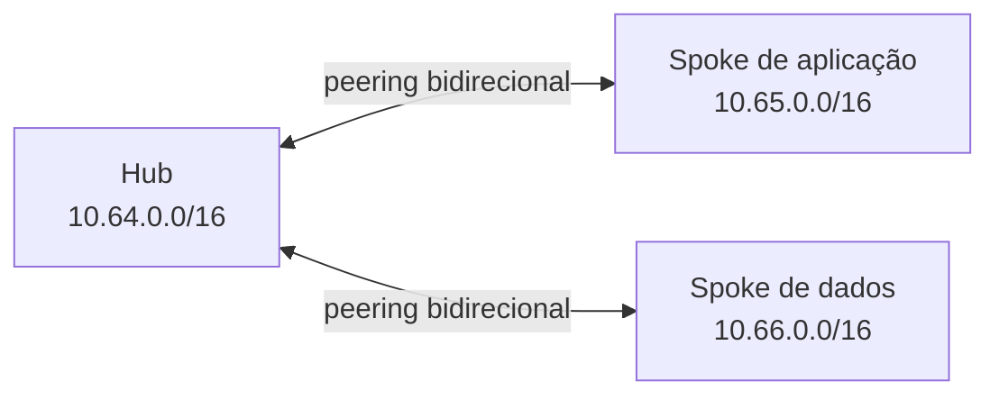

# Laboratório Azure com Terraform: rede hub and spoke

Este repositório contém a parte 1 de um laboratório prático de rede hub and spoke no Azure. O código cria uma VNet hub, duas VNets spoke, cinco subnets e quatro links direcionais de VNet peering. Não cria máquinas virtuais, Firewall, NVA, VPN Gateway, ExpressRoute, Bastion, NSGs ou tabelas de rotas. A filtragem das subnets fica para a próxima parte.

O artigo que explica as decisões de arquitetura, IPAM e organização do Terraform está em [Rede hub and spoke no Azure com Terraform, parte 1](https://rookieops.dev/posts/rede-hub-and-spoke-azure-terraform-parte-1/).

## Arquitetura



Os peerings conectam cada spoke ao hub. Eles não tornam o hub um roteador e não criam trânsito automático entre os spokes.

## Recursos previstos

| Tipo | Quantidade | Observação |
| --- | ---: | --- |
| Resource group | 3 | Um para o hub e um para cada spoke |
| VNet | 3 | Um hub e dois spokes |
| Subnet | 5 | Uma no hub e duas por spoke |
| VNet peering | 4 | Cada relacionamento precisa de um link por direção |

Os nomes usam os prefixos recomendados pelo Cloud Adoption Framework: `rg`, `vnet`, `snet` e `peer`. O formato inclui função, ambiente, código da região e instância.

## Pré-requisitos

- assinatura do Azure na qual você possa criar grupos de recursos e redes;
- [Azure CLI](https://learn.microsoft.com/pt-br/cli/azure/install-azure-cli) autenticada;
- [Terraform](https://developer.hashicorp.com/terraform/install) `1.15.8`;
- Git;
- fork deste repositório para testar mudanças próprias.

O AzureRM está fixado em `4.79.0`. O arquivo `.terraform.lock.hcl` registra os checksums selecionados por `terraform init`. Embora a major 5 já esteja disponível, a atualização exige leitura do guia de migração e uma nova validação do laboratório. Em v4.x, `resource_provider_registrations` usa `legacy` por padrão; este código escolhe `core` explicitamente. Na v5, o padrão passou a `none`.

Os exemplos de terminal usam PowerShell. O código Terraform funciona em Windows, Linux e macOS. Em Bash, use `cd` no lugar de `Set-Location` e `cp` no lugar de `Copy-Item`.

## Clonar ou usar seu fork

Crie um fork no GitHub e clone a sua cópia:

```powershell
git clone https://github.com/<SEU-USUARIO>/Laborat-rio-Azure-com-Terraform-Projetando-uma-rede-hub-and-spoke.git
Set-Location Laborat-rio-Azure-com-Terraform-Projetando-uma-rede-hub-and-spoke
```

Se você quiser apenas consultar o repositório original, troque `<SEU-USUARIO>` por `tkusal`.

## Configurar o ambiente

Autentique-se e confirme a assinatura antes de gerar qualquer plano:

```powershell
az login
az account set --subscription "<SUBSCRIPTION_ID>"
az account show --query "{nome:name, subscriptionId:id, tenantId:tenantId}" --output table
```

Pare se o tenant ou a assinatura não forem os esperados. Depois, crie o arquivo local de variáveis:

```powershell
Copy-Item environments/lab/terraform.tfvars.example environments/lab/terraform.tfvars
```

Edite `environments/lab/terraform.tfvars` e substitua:

- `subscription_id` pelo ID confirmado no comando anterior;
- `owner` pelo seu identificador ou pelo nome da equipe;
- `location` pela região real, como `brazilsouth`;
- `location_code` pelo código adotado nos nomes, como `brs`;
- `cost_center` se a assinatura exigir uma convenção diferente.

Arquivos `*.tfvars` são ignorados pelo Git. Não salve segredos em variáveis, planos ou state.

O provider também aceita `ARM_SUBSCRIPTION_ID` quando `subscription_id` não é definido em sua configuração. Para uma futura automação de CI, adapte o bloco do provider para usar essa variável de ambiente. O laboratório mantém o valor explícito no arquivo local para tornar a assinatura de destino visível durante o estudo.

## Formatar, inicializar e validar

Na raiz do repositório, verifique a formatação:

```powershell
terraform fmt -check -recursive .
```

Inicialize e valide o módulo raiz do laboratório:

```powershell
Set-Location environments/lab
terraform init
terraform validate
```

A configuração usa backend local para reduzir dependências no laboratório. O state fica em `environments/lab/terraform.tfstate` e é ignorado pelo Git. Em um ambiente de equipe ou produção, use um backend remoto protegido, com controle de acesso, criptografia, versionamento e locking.

## Gerar e revisar o plano

```powershell
terraform plan -out=plan.tfplan
terraform show plan.tfplan
```

Revise todos os nomes, CIDRs, tags, região, assinatura e quantidades. Um plano bem-sucedido não significa que a mudança é apropriada para a sua organização.

Se, depois dessa revisão, você decidir criar os recursos na sua própria assinatura, a execução é uma ação manual e consciente:

```powershell
terraform apply plan.tfplan
```

Este repositório não possui pipeline de deploy. O workflow de GitHub Actions executa somente `fmt`, `init -backend=false` e `validate`.

## Custos e segurança

A topologia não implanta recursos computacionais, mas VNet peering pode gerar cobrança por transferência de dados depois que houver cargas trocando tráfego. Região, direção e volume influenciam a cobrança. Consulte a [Calculadora de Preços do Azure](https://azure.microsoft.com/pt-br/pricing/calculator/) antes de criar recursos e valide as políticas da sua assinatura.

O state e os arquivos de plano podem conter dados sensíveis. Eles não devem entrar no controle de versão nem ser compartilhados sem análise.

## Remover o laboratório

Ao terminar, confirme novamente a assinatura, revise o plano de destruição e remova os recursos para evitar cobranças futuras:

```powershell
az account show --query "{nome:name, subscriptionId:id, tenantId:tenantId}" --output table
terraform plan -destroy
terraform destroy
```

O último comando solicita confirmação. Leia a lista inteira e não confirme se o state incluir algo que precise ser preservado.

## Estrutura do repositório

```text
.
|-- .github/
|   `-- workflows/
|       `-- terraform-check.yml
|-- environments/
|   `-- lab/
|       |-- backend.tf
|       |-- main.tf
|       |-- outputs.tf
|       |-- providers.tf
|       |-- terraform.tfvars.example
|       |-- variables.tf
|       `-- versions.tf
|-- modules/
|   `-- virtual-network/
|       |-- main.tf
|       |-- outputs.tf
|       `-- variables.tf
|-- .gitignore
|-- LICENSE
`-- README.md
```

## Licença

O código deste laboratório é distribuído sob a licença MIT. Consulte [LICENSE](LICENSE).
